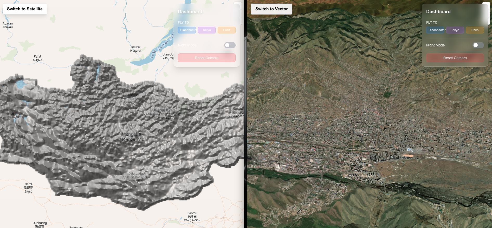
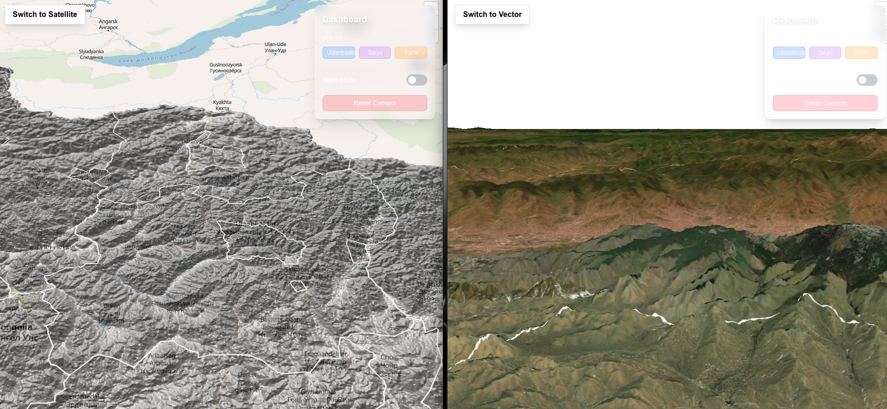

## Quick Start

Playground project for rendering Mongolian ASTER GDEM data using MapLibre and PMTiles.

This project is vibe coded.

## Features

* Render Mongolian ASTER GDEM data with MapLibre and PMTiles.
* Toggle between vector and satellite base maps.
* Toggle between 3D and 2D viewing modes.
* Toggle between day and night lighting modes.
* Toggle between light and dark UI themes.

## Installation

```bash
pnpm install

```

## Usage

```bash
pnpm run dev

```

## Pages

* `/app/page.tsx` - Main entry point (redirects to or mirrors 3D map).
* `/app/3d-map/page.tsx` - Dedicated 3D map interface.
* `/tracker/page.tsx` - Route tracker interface.

## Preview

---




